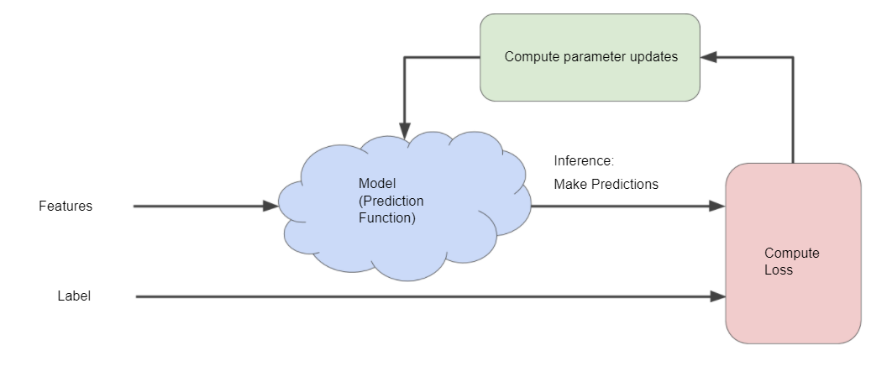

# Reducing Loss

## Gradient Descent
- Compute gradient of the loss function to find which direction to go at the next iteration
- Learning rate defines how big the gradient steps are 
- Gradient descent algorithm multiplies the gradient by the **learning rate** 

