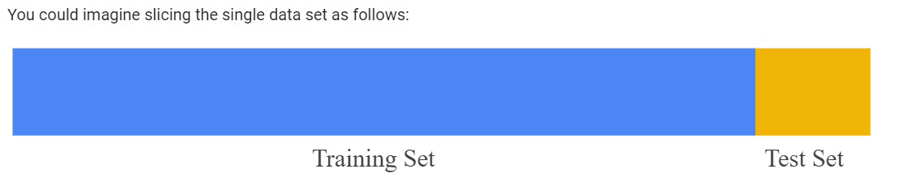

# Training and Testing
What if we only have one data set?
- Divide into two sets
	- One for training
	- One for testing
- **Do not train on test data**
	- Make sure you aren't doing this if you are getting suprisingly low loss

