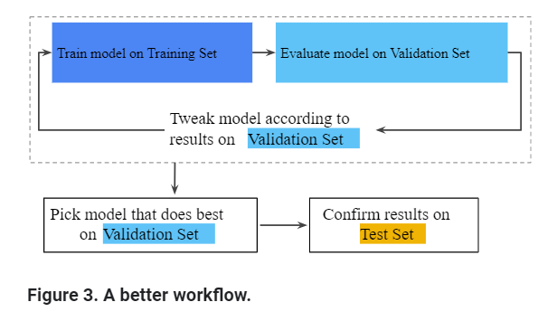

# Validation Set: Check Your Intuition
We looked at a process of using a teset set and a training set todrive iterations of 
model development. At each iteration we would train on the training data and evaluate on the test data.
- Note that this process is successptible to created a model that is overfitted if we do too many iterations. 

## Better workflow to mitigate the risk of overfitting

In this improved workflow:
1. Pick the model that does best on the validation set 
2. Double-check that model against the test set.

